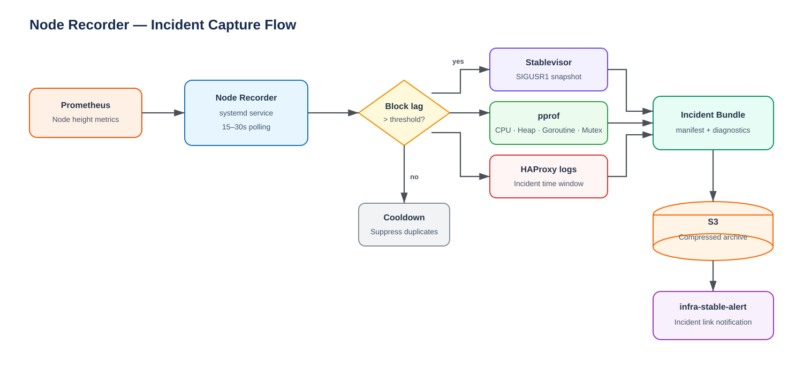

# Node Recorder

## TL;DR

Node Recorder is an internal operations tool that automatically collects diagnostic data the moment a blockchain node enters a block lag state.

The MVP polls Prometheus every 15 to 30 seconds to check whether an existing block lag alert is firing. When it fires, Node Recorder bundles a Stablevisor snapshot, pprof profiles, and HAProxy request logs into a single incident bundle and uploads it to S3. The upload result is shared in a Slack channel.

**Current priority**

- Implement the block lag trigger first, since it is needed to analyze a block lag incident already occurring on an Archive node.
- CPU, RAM, and Disk I/O based triggers are deferred to a later phase.

## Background

A Stable Archive node fell 82 blocks behind the network tip. The existing alert can tell us that lag occurred, but the data needed for root cause analysis is not preserved automatically at the time of the incident, including:

- the daemon's internal CPU usage paths and goroutine state
- client RPC requests around the incident window
- Stablevisor and daemon logs at the time
- system resource state

Once the incident ends, the state at that moment is hard to reproduce. A mechanism to automatically capture diagnostic data right after the trigger is needed.

## Architecture



### Components

| Component | Role |
|---|---|
| Prometheus | Stores each node's height and existing system metrics |
| Node Recorder | Queries Prometheus firing alerts, orchestrates artifact collection and upload |
| Stablevisor | Receives SIGUSR1 and produces its existing daemon and system incident snapshot |
| pprof | Provides CPU, heap, goroutine, and mutex profiles |
| HAProxy | Provides the client HTTP request record around the incident |
| S3 | Stores the compressed incident bundle |
| Slack channel | Shares the incident occurrence and S3 artifact location |

## Detection

Node Recorder runs as a systemd service and queries the Prometheus HTTP API every 15 to 30 seconds.

### Block lag trigger

Node Recorder does not compute block lag itself. It periodically queries the state of the existing Prometheus alert, `CometBFTBlockHeightBehind`, defined in `stablebft_alert_rules.yml`. For `chain="stable"`, the rule fires when more than `40 blocks` behind the network tip, with `for: 10s`, meaning the condition only needs to hold briefly before the alert fires. The actual threshold and `for` condition are evaluated entirely by the Prometheus alert rule, not by Node Recorder, so the threshold stays managed in one place.

```javascript
ALERTS{
  alertname="CometBFTBlockHeightBehind",
  alertstate="firing",
  instance="<NODE_ID>"
} == 1
```

Confirmed: the `instance` label carries the `NODE_ID` format used elsewhere in this doc (e.g. `main-stable-archive-ovh-de`), not the `target` label the rule also carries. The label name used for matching is kept configurable (`ALERT_NODE_LABEL`, see Configuration) rather than hardcoded to `instance`, in case this changes per node or network later.

Incident capture only runs when a firing alert exists for that node.

To avoid repeated collection, Node Recorder keeps a state machine:

```plain text
idle -> capturing -> cooldown -> idle
```

- **capturing**: artifact collection is in progress
- **cooldown**: the period during which the same node and alert combination will not be recollected
- the dedup key is `node + alertname`
- a Prometheus query failure is treated as an internal error, not as a block lag incident
- if a previous run has not finished, a file lock prevents a duplicate run

## Capture Flow

1. Query the `ALERTS` metric in Prometheus for the node's block lag alert.
2. Check whether a result with `alertstate="firing"` exists.
3. Check the lock and cooldown state.
4. Create the incident ID and working directory.
5. Send SIGUSR1 to the Stablevisor process to trigger its incident snapshot, then poll until the snapshot directory's `.complete` marker appears (see Stablevisor Signal and Snapshot below) rather than assuming the write finished synchronously.
6. Immediately collect goroutine, heap, and mutex profiles in parallel.
7. Collect a CPU profile for a configured duration.
8. Extract the incident time window from `/var/log/haproxy.log`.
9. Write the manifest and record any collection errors.
10. Compress all files and upload them to S3.
11. Send the S3 location and collection result to the Slack channel.
12. Clean up local temporary files and enter cooldown.

## Stablevisor Signal and Snapshot

Confirmed against Stablevisor's own incident-collector spec:

- `SIGUSR1` calls `TriggerSnapshot(reason)` directly; the same path also fires automatically on `daemon.crashed`.
- Snapshots are written atomically: data lands in a `.tmp-<id>` directory first, then the directory is renamed to its final `<id>`, then a `.complete` marker file is written inside it. `ListIncidents`/`GetIncident` (and Node Recorder) must only treat a directory as ready once `.complete` exists.
- The snapshot's log capture is a ring buffer (5,000 lines / roughly 8-10 minutes of history by default), so SIGUSR1 must be sent promptly after the block-lag alert fires or earlier log context is lost.
- Retention is 10 incidents or 10GB total, oldest deleted first. Node Recorder should pick up the newly created snapshot before it can be rotated away by unrelated incidents.

Decision: look up the PID via systemd (`systemctl show <STABLEVISOR_SERVICE_NAME> --property=MainPID --value`) immediately before sending the signal, rather than a PID file or `pgrep`/`pidof` name matching. Stablevisor is not documented to write a PID file, and process-name matching is fragile across restarts; systemd already tracks the authoritative live PID for any unit it supervises, and Node Recorder is itself deployed as a systemd service, so this adds no new dependency. A `MainPID` of `0` means the service isn't running, which routes into the existing "Stablevisor not running" failure path below.

## Collected Artifacts

| Artifact | Collection | Purpose |
|---|---|---|
| Stablevisor snapshot | SIGUSR1 | daemon stdout/stderr, Stablevisor logs, config hash, system state |
| CPU profile | `/debug/pprof/profile?seconds=N` | Identify which functions consumed CPU |
| Heap profile | `/debug/pprof/heap` | Check memory allocation and retention |
| Goroutine profile | `/debug/pprof/goroutine` | Check blocked goroutines and stacks |
| Mutex profile | `/debug/pprof/mutex` | Check lock contention |
| HAProxy log | time window extraction | Check RPC method, client, and latency around the incident |
| Manifest | generated by Node Recorder | Records trigger, height, timestamp, files, and collection errors |

The pprof endpoint must not be exposed on a public interface. It must only be reachable over loopback or an internal management network.

## Incident Bundle

```plain text
node-recorder/
  stable/
    main-stable-archive-ovh-de/
      20260731T090700Z-block-lag/
        manifest.json
        stablevisor/
          incident-20260731-090700-123456/
        pprof/
          cpu.pb.gz
          heap.pb.gz
          goroutine.pb.gz
          mutex.pb.gz
        logs/
          haproxy.log
```

### Manifest example

```json
{
  "schema_version": 1,
  "incident_id": "20260731T090700Z-block-lag",
  "node": "main-stable-archive-ovh-de",
  "chain": "stable",
  "trigger": "block_lag",
  "triggered_at": "2026-07-31T09:07:00+09:00",
  "local_height": 1234000,
  "network_tip_height": 1234082,
  "lag_blocks": 82,
  "stablevisor_incident_id": "incident-20260731-090700-123456",
  "artifacts": {
    "cpu_profile": "ok",
    "heap_profile": "ok",
    "goroutine_profile": "ok",
    "mutex_profile": "ok",
    "haproxy_log": "ok"
  },
  "errors": []
}
```

If some artifact collection fails, the upload of the remaining data still proceeds. Failures are recorded in `errors`.

## HAProxy Logging Policy

For the MVP, the raw HAProxy log is trimmed to the incident time window and kept as is.

Confirmed:

- log path is `/var/log/haproxy.log`
- the request body is included in the log, truncated to a maximum length of `65536` bytes
- sensitive data (transaction, signature, credential fields) is **not** masked
- disk usage impact from storing the request body is negligible

Still open:

- whether the incident window needs to be extracted from rotated log files

**Note:** the CPU and memory overhead from HAProxy request body logging was found to be minimal, and disk usage has now also been confirmed as negligible.

## Configuration

```bash
NODE_ID="main-stable-archive-ovh-de"
CHAIN="stable"

# Prometheus alert rule (informational only, owned by the alert rule)
BLOCK_LAG_THRESHOLD_BLOCKS="40"

# Node Recorder
PROMETHEUS_URL="http://monitoring.internal:9090"
ALERT_NAME="CometBFTBlockHeightBehind"
ALERT_STATE="firing"
ALERT_NODE_LABEL="instance"
POLL_INTERVAL_SECONDS="15"
COOLDOWN_SECONDS="900"

STABLEVISOR_SERVICE_NAME="stablevisor"

PPROF_URL="http://127.0.0.1:6060/debug/pprof"
CPU_PROFILE_SECONDS="20"

HAPROXY_LOG="/var/log/haproxy.log"
LOG_WINDOW_BEFORE_SECONDS="600"

S3_PREFIX="s3://altuslabs-node-recorder/node-recorder"

SLACK_WEBHOOK_URL="<secret>"
```

`BLOCK_LAG_THRESHOLD_BLOCKS` is applied on the Prometheus alert rule side and is `40` for `chain="stable"`. Node Recorder does not re-evaluate this threshold itself; the value here is documentation, not enforcement.

Real secrets (including `SLACK_WEBHOOK_URL`) must not be committed to the script. On AWS, prefer the instance role. The authentication method for any other environment is decided separately.

## S3 Upload Permissions

Bucket: `altuslabs-node-recorder`. The policy below grants only what the upload step needs, write access under `node-recorder/`, no read, no delete, no bucket-level permissions.

```json
{
  "Version": "2012-10-17",
  "Statement": [
    {
      "Sid": "NodeRecorderUpload",
      "Effect": "Allow",
      "Action": [
        "s3:PutObject",
        "s3:AbortMultipartUpload"
      ],
      "Resource": "arn:aws:s3:::altuslabs-node-recorder/node-recorder/*"
    }
  ]
}
```

Attach this to the instance role (per the AWS preference above) rather than issuing long-lived credentials. `s3:AbortMultipartUpload` covers incident bundles large enough to use multipart upload; it is not needed if bundles always upload as a single `PutObject` call.

## Slack Notification

Decision: post via an **Incoming Webhook URL**, not a bot token. A single POST per incident (S3 location plus collection result summary) fits a post-only, single-channel use case. No message editing, reactions, or channel listing is needed, so the extra scope and setup of a full bot integration isn't justified. The webhook URL is a secret and follows the same handling as `SLACK_WEBHOOK_URL` above: not committed to the script, injected at deploy time.

## Runtime and Deployment

### Files

```plain text
/usr/local/bin/node-recorder
/etc/node-recorder/config
/var/lib/node-recorder/state/
/var/lib/node-recorder/incidents/
/run/node-recorder.lock
```

### systemd

- `Restart=always` to keep the watcher running
- the run user gets only the minimum privileges needed for Stablevisor signaling, HAProxy log reads, and pprof loopback access
- `NoNewPrivileges=true`
- read-only filesystem outside the local incident directory
- local artifacts are cleaned up according to the configured retention after a successful S3 upload
- deployed identically to Full Archive and RPC nodes through an Ansible role

## Failure Handling

| Failure | Behavior |
|---|---|
| Prometheus unavailable | Collection is not started, only an error is logged |
| pprof unavailable | Failure recorded, HAProxy and Stablevisor collection continues |
| Stablevisor not running | Failure recorded, remaining artifact collection continues |
| S3 upload failed | Local bundle is kept, retried with a limited retry count on the next run |
| Duplicate trigger | Skipped due to lock or cooldown |

## Source

This document is derived from the Notion spec [Node Recorder](https://app.notion.com/p/bharvest/Node-Recorder-3aec1352439b80d094d2fd7ac7ff9421), status WIP as of 2026-08-01.
